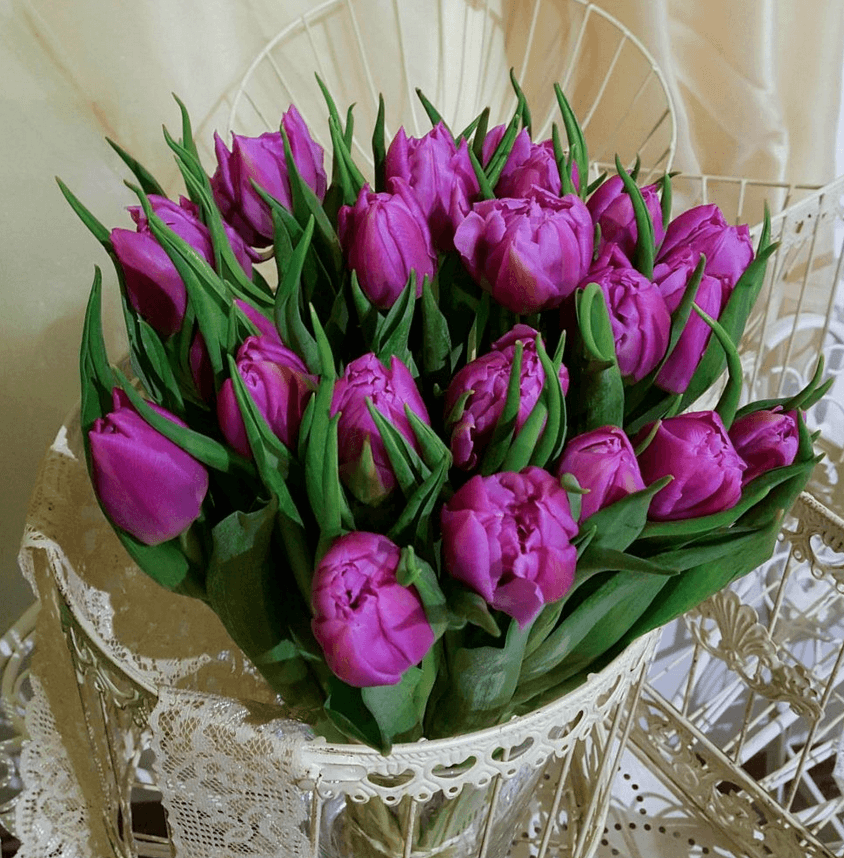
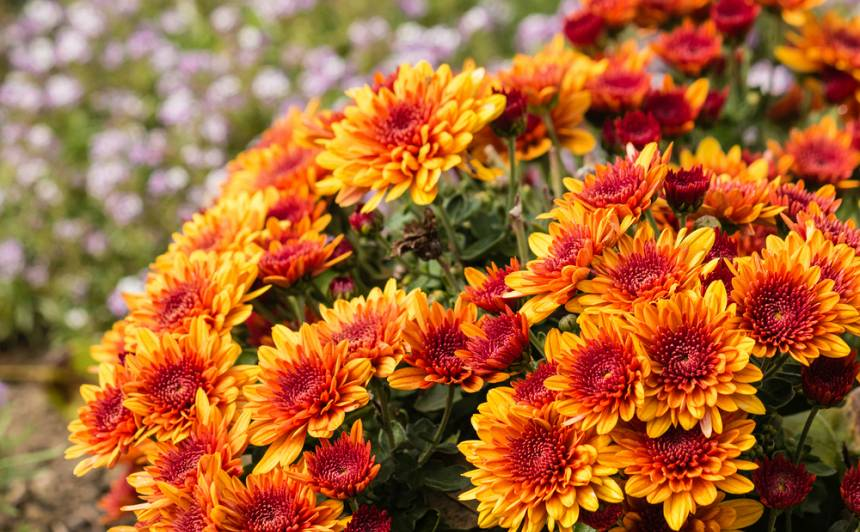
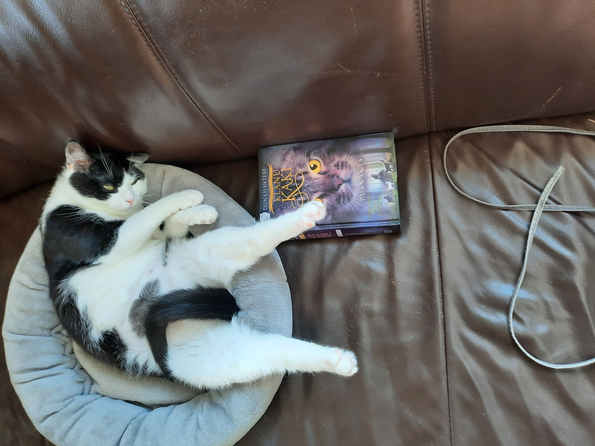
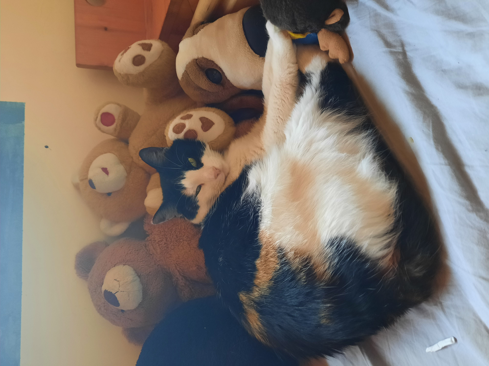

# Šis ir mans otrais mājasdarbs
## 200 vārdu apraksts par mani
Mans vārds ir Anda.

Esmu nāku no Limbažu puses. Esmu LLU studējusi grāmatvedību. Pēc studijām paliku dzīvot Jelgavas pusē.
Pašlaik es dzīvoju lauku teritorijā mājā. Pie mājas ir plaša teritorija, kuru vajag apkopt. Līdz ar to ir ļoti 
daudz darba.

### Profesionālā pieredze, izglītība
Esmu grāmatvede un darbojos arī ar grāmatvedības datorprogrammas testiem jau vairāk kā 18 gadus.
Savā darbā apmācu arī jaunos speciālistus darboties ar grāmatvedības datorprogrammām.
Man ir pieredze arī uzstāties līdz 100 cilvēku lielas auditorijas priekšā par grāmatvedības aktualitātēm.

Esmu piedalījusies **LU apmācībā "Ievads testēšanā"**. Iegūtās zināšanas un prasmes bija iespēja uzreiz likt lietā savā 
darbā, testējot rēķinu izrakstīšanas vietni.
Tagad vēlos apgūt automatizēto testēšanu, lai testēšanu padarītu patīkamāku. Jo testējot apnicīgi ir regresa testi. 
Sevišķi būtu nepieciešams uzzināt, kā testēt desktop programmas.

Pēc dabas esmu introverta. Man patīk maz runāt. Bet protu runāt, ja vajag:) Patīk iedziļināties un analizēt.
Grūti saprast cilvēkus, kuri kaut kam akli tic.

### Hobiji
**Mans hobijs ir dārzkopība.**
Es mēdzu iepirkties šajā mājas lapā [Baizas](https://www.baizas.lv/news/1088).

Pavasarī manas mīļākās puķes ir ***tulpes***. Man dārzā ir vairāki desmiti šķirnes.

Rudenī savukārt man patīk mārtiņrozes.

**Mans mīļākais mājdzīvnieks ir kaķis.** Man mājās ir trīs kaķi.
Pati jaunākā ir ***Pūciņa***. Viņa ir vismīļākā un drošākā.

Otra ir ***Kate***. Viņa ir ļoti jūtīga un trauksmaina. Viņa ir lieliska peļu medniece. Un arī ļoti mīļa, ja jūtas droši.

Trešā ir ***Lūse***. Viņa mums ir ar raksturu. Atļauj sev pieskarties tikai līdz zināmai robežai.
Nav draudzīga ar citiem kaķiem.

Man patīk lasīt izglītojošas grāmatas un klausīties izglītojošus raidījumus. Piemēram, aktīvi sekoju līdzi mājas 
lapai Ugunskola [Ugunsskola](https://ugunsskola.lv/jaunumi/).

Man patīk ievērot veselīgu dzīvesveidu. Tas sevī ietver miegu, veselīgu ēdienu un fiziskas aktivitātes. Visgrūtāk
ir ievērot atpūtu no darbiem.
